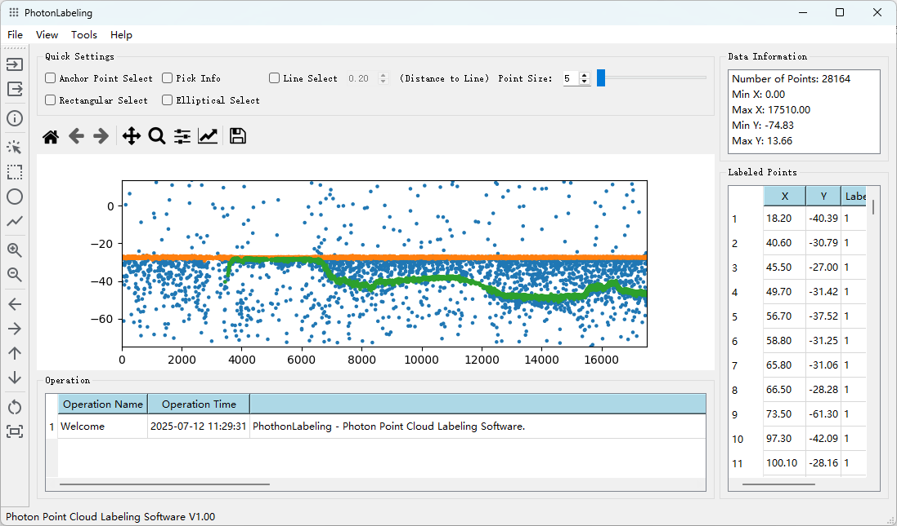
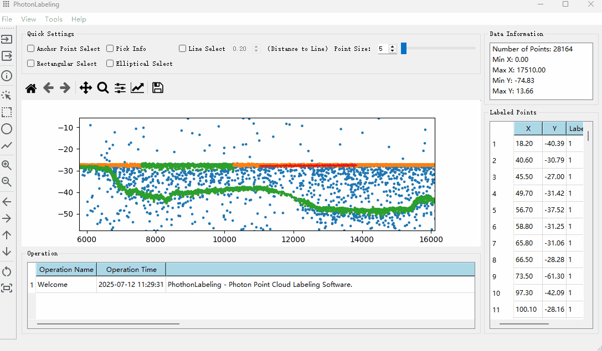

# PhotonLabeling v1.0

PhotonLabeling is a lightweight desktop tool for labeling **photon point cloud data**, designed for scientific research and data preprocessing tasks. It provides interactive functions such as zoom, pan, rectangular/ellipse selection, point editing, and data export.

---

## 🌟 Features

- ✅ Load CSV-format photon point cloud data
- ✅ Interactive visualization (pan, zoom, aspect-ratio locking)
- ✅ Rectangle, ellipse, and line-based selection tools
- ✅ Point-level editing and labeling
- ✅ Real-time operation logging
- ✅ Export labeled results to CSV
- ✅ English/Chinese user interface (coming soon)

---

## 📸 Interface Preview

### Main Window



### Zoomed Region with Selection



---

## 📂 File Format

Input file format should be a CSV file with **X** and **Y** coordinates. You can select the corresponding column numbers when loading data.

Example:

```csv
x_coord,y_coord,label
123.4,456.7,0
125.1,458.3,0
...
