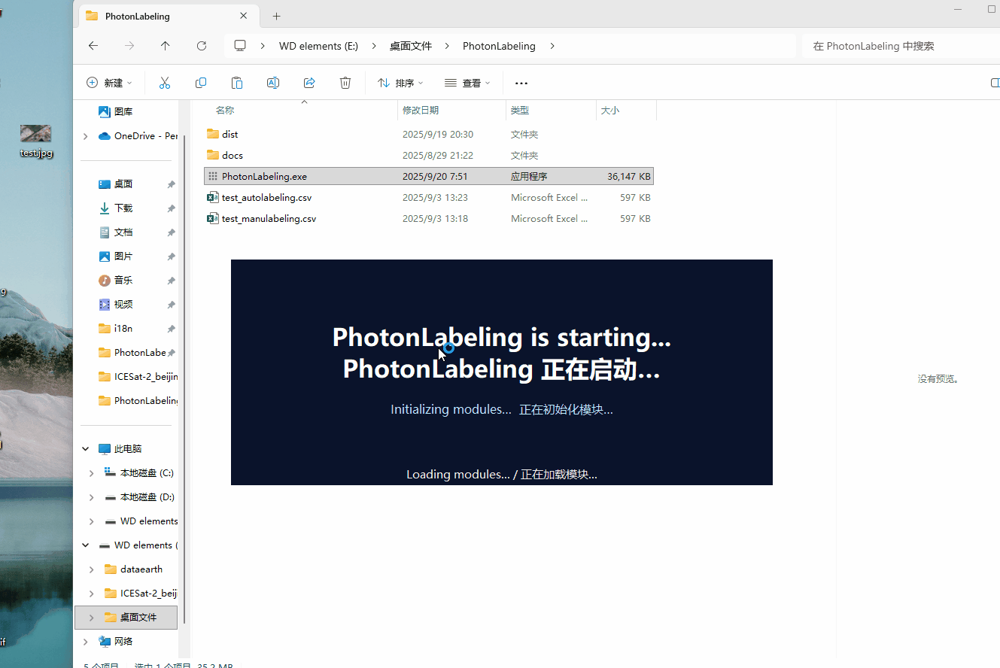

# PhotonLabeling

PhotonLabeling is a lightweight desktop tool for labeling **photon point cloud data**, designed for scientific research and data preprocessing tasks. It provides interactive functions such as zoom, pan, rectangular/ellipse selection, point editing, and data export.

---

## 🌟 Features

- ✅ Load CSV-format photon point cloud data
- ✅ Interactive visualization (pan, zoom, aspect-ratio locking)
- ✅ Rectangle, ellipse, and line-based selection tools
- ✅ Point-level editing and labeling
- ✅ Real-time operation logging
- ✅ Export labeled results to CSV

---

## 📸 Main Window


Full Localization
The entire application—UI, menus, dialogs, message prompts, and operation logs—has been fully localized into Chinese.

Language Switching (Chinese / English)
Go to Settings → Language and choose Chinese (Simplified) or English.
After switching, you’ll be prompted to restart the app so all interfaces (including already-open dialogs) update correctly.

Help & Updates
Use Help → Check for Updates to open the project homepage and view the latest version and changes.


完整汉化
应用界面、菜单、对话框、消息提示、操作日志等全面中文化。

语言切换（中文 / English）
菜单：设置 → 语言 (Settings → Language) 中选择 中文（简体） 或 English。
切换后会提示重启应用以确保所有界面生效（含已打开的对话框）。

帮助与更新
帮助 → 检查更新 可打开项目主页，查看最新版本与变更。


---

PhotonLabeling – New Feature Overview

WebMap Geographic Map Viewer

WebMap visualizes the spatial distribution of satellite photon point-cloud data on online satellite imagery. It supports switching between Google Satellite and ESRI World Imagery basemaps. Users can hover over any point to display its latitude, longitude, and elevation (height above ellipsoid) in real-time.

The map is interactively linked with the main application window: whenever a rectangular region is selected there, WebMap automatically synchronizes the selection footprint and zooms to the corresponding location.


Label Configuration & Management

This module manages the mapping between label values and label names, while dynamically updating per-label point counts using a built-in statistics panel. The software includes 9 commonly used predefined label categories, such as Noise, Signal, Ground, and Vegetation, each assigned a distinct color for rapid visual separation.


## 📂 File Format

Input file format should be a CSV file with **X** and **Y** coordinates. You can select the corresponding column numbers when loading data.

Example:

```csv
x_coord,y_coord,label
123.4,456.7,0
125.1,458.3,0
```

## 📖 Citation

If this software is useful for your research, please cite the following paper:

Shi, Z., Li, J., Yang, Z., Long, H., Cui, H., Zhao, S., Li, X., Li, Q. (2025). A Linear Feature-Based Method for Signal Photon Extraction and Bathymetric Retrieval Using ICESat-2 Data. Remote Sensing, 17(16), 2792. https://doi.org/10.3390/rs17162792
