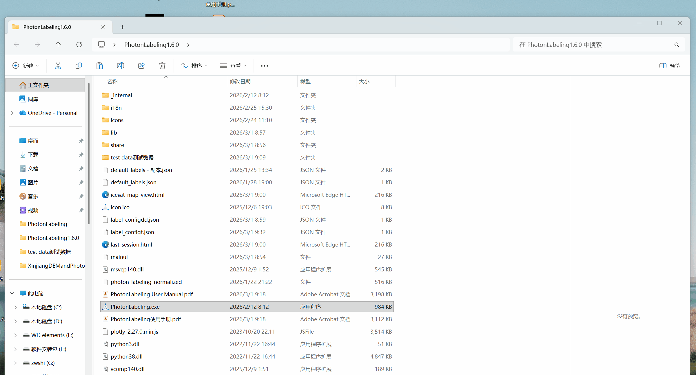
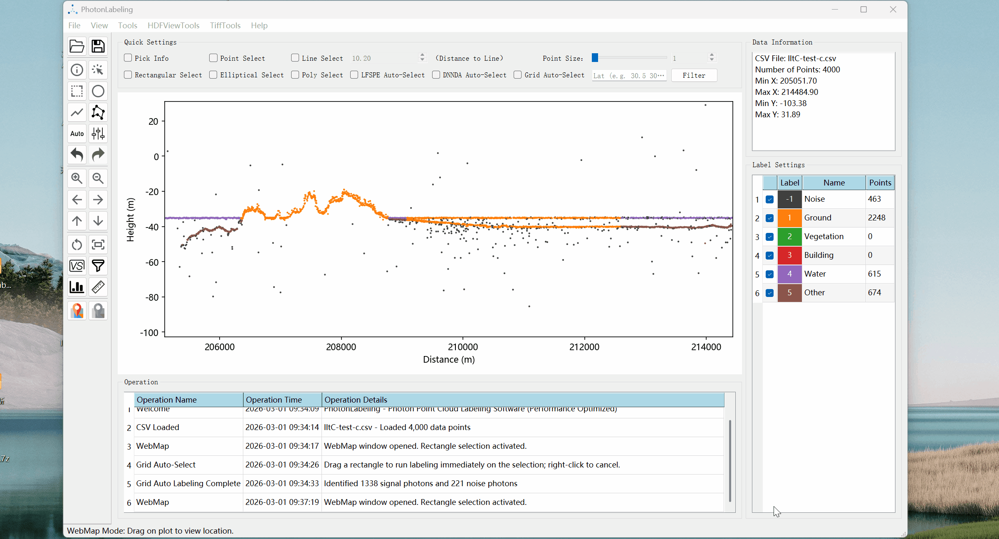
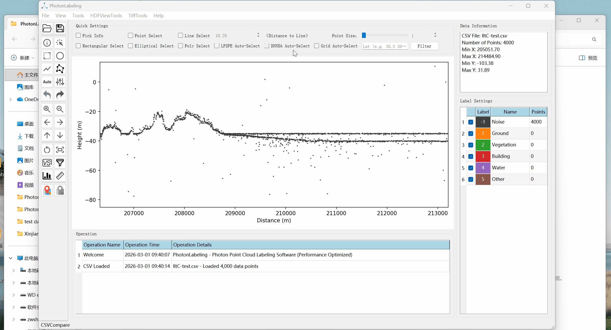
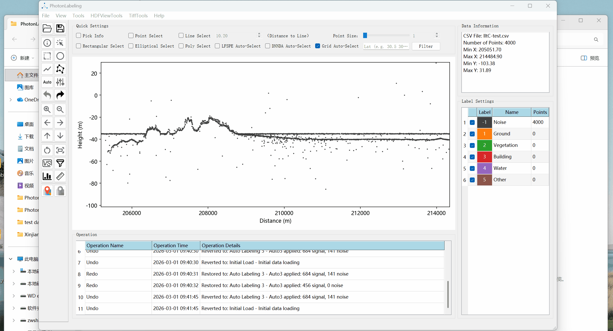
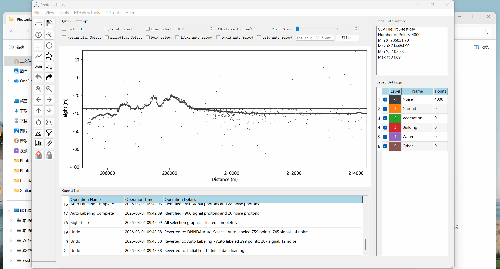
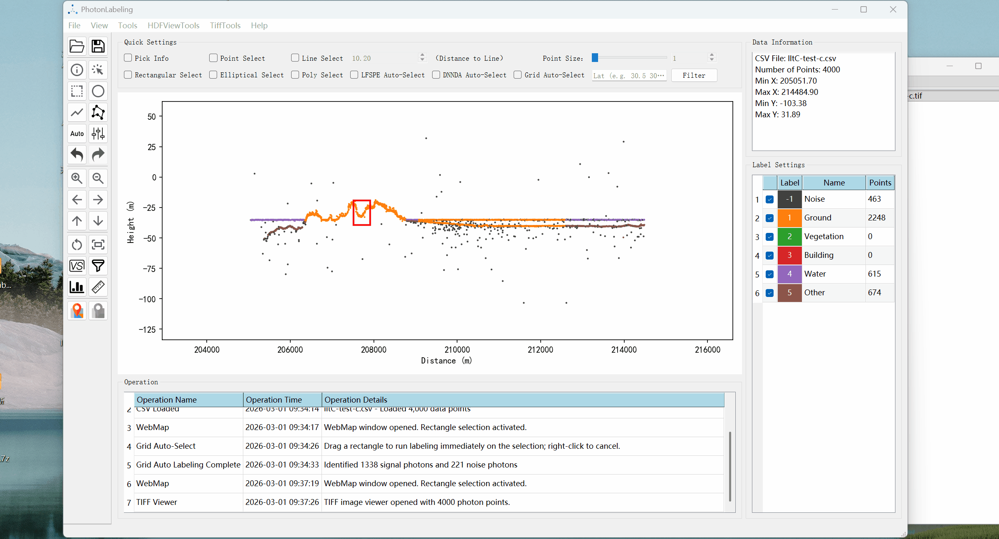

# PhotonLabeling

PhotonLabeling is a lightweight desktop tool for labeling **photon point cloud data**, designed for scientific research and data preprocessing tasks. It provides interactive functions such as zoom, pan, rectangular/ellipse selection, point editing, and data export.

## 📘 User Manuals / 使用手册
**PhotonLabeling User Manual (EN):**  
  https://github.com/user-attachments/files/24147983/PhotonLabeling.User.Manual.pdf
  
**PhotonLabeling 使用手册 (中文):**  
  https://github.com/user-attachments/files/24147985/PhotonLabeling.pdf

## 📥 Download / 下载

**Releases:** https://github.com/zwshi-pku/PhotonLabeling/releases

---

## 🌟 Features

✅ Load CSV-format photon point cloud data

✅ Interactive visualization (pan, zoom, aspect-ratio locking)

✅ Rectangle, ellipse, and line-based selection tools

✅ Point-level editing and labeling

✅ Real-time operation logging

✅ Export labeled results to CSV

---

## 📸 Main Window

## 🌐 Localization / 本地化与语言切换
Language Switching (Chinese / English)
Go to Help → Language and choose Chinese or English.
After switching, you’ll be prompted to restart the app so all interfaces (including already-open dialogs) update correctly.

Help & Updates
Use Help → Check for Updates to open the project homepage and view the latest version and changes.

应用界面、菜单、对话框、消息提示、操作日志等汉化。

语言切换（中文 / English）
菜单：help → 选择中文。
切换后会提示重启应用以确保所有界面生效。

帮助与更新
帮助 → 检查更新 可打开项目主页，查看最新版本与变更。

---

## 📂 File Format

Input file format should be a CSV file. You can select the corresponding column numbers when loading data.

## 📖 Citation

If this software is useful for your research, please cite the following paper:

Shi, Z., Li, J., Yang, Z., Long, H., Cui, H., Zhao, S., Li, X., Li, Q. (2025). A Linear Feature-Based Method for Signal Photon Extraction and Bathymetric Retrieval Using ICESat-2 Data. Remote Sensing, 17(16), 2792. https://doi.org/10.3390/rs17162792
